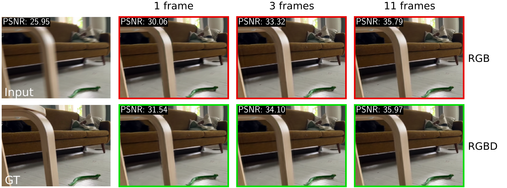

# DAVIDE - Benchmark
[](https://germanftv.github.io/DAVIDE.github.io/)
[](https://arxiv.org/abs/2409.01274)

This repository provides the source code for benchmarking deep video deblurring methods on the DAVIDE dataset. The dataset and methods are introduced in the paper **"DAVIDE: Depth-Aware Video Deblurring" (ECCVW 2024)**.

<p align="center">
    
        <br>
        <em>Fig. 1. Examples of depth-aware video deblurring with an increasing context window in the input.</em>
</p>

 ### [Project Page](https://germanftv.github.io/DAVIDE.github.io/) | [arXiv](https://arxiv.org/abs/2409.01274) | [Dataset Synthesis Repository](https://github.com/germanftv/DAVIDE-Synthesis.git)  | [Data Capture App](https://github.com/JussiKalliola/DAVIDE-app) | [Data Access Form](https://docs.google.com/forms/d/e/1FAIpQLSeQ2w4xsoIkzJ6kNseSiHkMaj303_tXRs2v23wqF3chfSF1FQ/viewform?usp=header)

 ## 📑 Contents

1. [Getting Started](#-getting-started)
2. [Download DAVIDE Dataset and Demo Resources](#-download-davide-dataset-and-demo-resources)
2. [Demo](#-demo)
3. [Train and test](#-train-and-test)
4. [Results](#-results)
4. [Other Resources](#-other-resources)
5. [Citation](#citation)

## 🚀 Getting started

### Requirements:

Ensure the following dependencies are installed and available:

1. **Conda**: Required for managing the project's environments.
2. **CUDA-enabled GPU**: GPU with CUDA support is required for running demos and training/testing models. Minimum CUDA version: 11.7.

### Installation

1. Install conda environment and basicsr package
    ```bash
    conda env create -n DAVIDE-Benchmark -f env.yml
    conda activate DAVIDE-Benchmark
    pip install -e .
    ```
2. Environment variables:
    This code uses the following environment variables:
    - Demo:
        * `DEMO_DATA_ROOT`: Path to the demo data.
        * `DEMO_RESULTS_ROOT`: Path to the demo results.
        * `DAVIDE_CKPTS_DIR`: Path to the released model checkpoints.
    - Train and test:
        * `DATASET_ROOT`: Path to the DAVIDE dataset.
        * `EXPS_ROOT`: Path to the training experiments folder.
        * `RESULTS_ROOT`: Path to the testing results folder.
    
    You can manually set these variables or use conda to set constant values. For example:
    ```bash
    conda env config vars set DEMO_DATA_ROOT=./dataset
    conda env config vars set DEMO_RESULTS_ROOT=./results/demo-data
    conda env config vars set DAVIDE_CKPTS_DIR=./model_zoo/davide_checkpoints     
    conda env config vars set DATASET_ROOT=./dataset/DAVIDE
    conda env config vars set EXPS_ROOT=./experiments
    conda env config vars set RESULTS_ROOT=./results
    ```

## 📥 Download DAVIDE Dataset and Demo Resources

To download the DAVIDE dataset and demo resources, follow these steps:

1. **Demo Data and Model Checkpoints**  
    Use the scripts below to download demo data and model checkpoints:
    ```bash
    bash ./dataset/download_demo_data.sh <username> <password> --clean
    bash ./model_zoo/download_davide_checkpoints.sh <username> <password> --ckpt_dir $DAVIDE_CKPTS_DIR
    ```

2. **Official DAVIDE Dataset**  
    Download the full dataset using the following script:
    ```bash
    bash ./dataset/download_davide_dataset.sh <username> <password> --mono_depth --meta_data --clean
    ```

> **Notes:**
> - Complete the [request form](https://docs.google.com/forms/d/e/1FAIpQLSeQ2w4xsoIkzJ6kNseSiHkMaj303_tXRs2v23wqF3chfSF1FQ/viewform?usp=header) to obtain credentials for downloading the resources. Credentials will be sent via email. Replace `<username>` and `<password>` with your credentials.
> - For additional options, check the help of the downloading script with `-h` flag:  
>       ```
>       bash ./<path_to>/<downloading_script>.sh -h
>       ```
>

## 🎮 Demo

We provide a demo script ([`./basicsr/demo.py`](./basicsr/demo.py)) to showcase our results on six test demo clips: `toy01`, `farm03`, `indoors02`, `play_ground05`, `robot04`, and `birds07`. Each clip consists of 50 frames. The demo highlights results for the following three experiments:

### 1. **Depth Impact**

This experiment demonstrates the deblurring performance of the base RGB ShiftNet and the extended RGBD ShiftNet architectures as the temporal context window length was increased during training. Each model was trained with three different seeds for statistical robustness, as described in the paper.

Run the following command:
```bash
python basicsr/demo.py \
    --exp depth_impact \
    --clip <clip> \
    --model <shiftnet_variant> \
    --window_size <size> \
    --seed <seed> \
    --results_dir $DEMO_RESULTS_ROOT \
    --ckpt_dir $DAVIDE_CKPTS_DIR
```

**Options:**
- `<clip>`: Select one of the following clips: `toy01`, `farm03`, `indoors02`, `play_ground05`, `robot04`, or `birds07`.
- `<shiftnet_variant>`: Choose between the base RGB ShiftNet (`Shiftnet_baseRGB`) or the extended RGBD ShiftNet (`Shiftnet_RGBD`).
- `<size>`: Context window length during training (valid values: 1, 3, 5, 7, 9, or 11).
- `<seed>`: Training seed (valid values: 10, 13, or 17). If not provided, the default seed is 13.

---

### 2. **State-of-the-Art Comparison**

This experiment compares the deblurring performance of the 11-window-length ShiftNet models with other state-of-the-art models.

Run the following command:
```bash
python basicsr/demo.py \
    --exp sota_comparison \
    --clip <clip> \
    --model <model_arch> \
    --results_dir $DEMO_RESULTS_ROOT \
    --ckpt_dir $DAVIDE_CKPTS_DIR
```

**Options:**
- `<clip>`: Select one of the following clips: `toy01`, `farm03`, `indoors02`, `play_ground05`, `robot04`, or `birds07`.
- `<model_arch>`: Choose one of the following architectures: `Shiftnet_RGBD`, `Shiftnet_baseRGB`, `RVRT`, `VRT`, `EDVR`, `DGN_single_frame`, or `DGN_multi_frame`.

---

### 3. **Depth Quality**

This experiment evaluates the effect of different depth types used as input for the RGBD ShiftNet architecture.

Run the following command:
```bash
python basicsr/demo.py \
    --exp depth_quality \
    --clip <clip> \
    --depth <depth_type> \
    --results_dir $DEMO_RESULTS_ROOT \
    --ckpt_dir $DAVIDE_CKPTS_DIR
```

**Options:**
- `<clip>`: Select one of the following clips: `toy01`, `farm03`, `indoors02`, `play_ground05`, `robot04`, or `birds07`.
- `<depth_type>`: Choose one of the following depth types:
  - `sensor`: Real-captured depth.
  - `mono_blur`: Monocular depth estimates from blurry input.
  - `mono_sharp`: Monocular depth estimates from sharp input.

---

> **Note:** The settings used in this demo differ slightly from those used in the testing experiments reported in the paper. For detailed notes on the demo settings, refer to [`./options/demo/demo_notes.md`](./options/demo/demo_notes.md).

## 🧠 Train and Test

### 1. **Training Jobs**
    
To train a deblurring model, follow these steps:

- **Prepare Training Data**  
    Convert the training data folders into `lmdb` format for data loading efficiency:
    ```bash
    python scripts/data_preparation/create_lmdb.py \
         --dataset_path $DATASET_ROOT \
         --n_thread 16
    ```

- **Launch Training**  
    Start a training job by selecting the appropriate launcher: `none`, `pytorch`, or `slurm`. Adjust the `num_gpu` parameter in the configuration files based on your available computing resources.

    - **Single GPU Training**:
      ```bash
      python basicsr/train.py --launcher none --opt /path/to/main_config --opt /path/to/alt_config
      ```

    - **Distributed Training on Workstation (4 GPUs)**:
      ```bash
      python -m torch.distributed.launch --nproc_per_node=4 basicsr/train.py \
            --launcher pytorch --opt /path/to/main_config --opt /path/to/alt_config
      ```

    - **Distributed Training on SLURM Cluster**:
      ```bash
      python basicsr/train.py --launcher slurm --opt /path/to/main_config --opt /path/to/alt_config
      ```

### 2. **Testing Jobs**

To launch a test job, use the following command:
```bash
python basicsr/test.py --launcher none --opt /path/to/main_config --opt /path/to/alt_config
```

> **Notes:**  
> - Configuration files for training and testing experiments are available in the [`options/experiments`](./options/experiments/) directory.  
> - SLURM scripts for running experiments on clusters are provided in [`scripts/slurm/experiments`](./scripts/slurm/experiments/).  
> - Ensure paths to configuration files (`/path/to/main_config` and `/path/to/alt_config`) are correctly set before running the commands.

## 📊 Results

### Generating Tables and Figures
After computing all test results, you can generate tables and figures using the scripts provided in the [`scripts/reports`](./scripts/reports/) directory. Follow these steps:

1. Navigate to the `scripts/reports` directory:
    ```bash
    cd scripts/reports
    ```
2. Run the following scripts to generate specific results:
    - **Architecture Ablation Study**:
      ```bash
      python E0_arch_ablation.py
      ```
    - **Depth Quality Analysis**:
      ```bash
      python E0_depth_quality.py
      ```
    - **Depth Impact Evaluation**:
      ```bash
      python E1_depth_impact.py
      ```
    - **Depth Impact on Attributes**:
      ```bash
      python E1_depth_impact_attributes.py
      ```
    - **Depth Impact accross Confidence bins**:
      ```bash
      python E1_depth_impact_confidence.py
      ```    
    - **Comparison with State-of-the-Art**:
      ```bash
      python E2_sota_comparison.py
      ```
    > **Note:**  Ensure that a LaTeX compiler is installed on your system. If not, please disable LaTeX rendering in the following scripts:
    >- [`E1_depth_impact.py`](./scripts/reports/E1_depth_impact.py#L355)
    >- [`E1_depth_impact_attributes.py`](./scripts/reports/E1_depth_impact_attributes.py#L539)
    >- [`E1_depth_impact_confidence.py`](./scripts/reports/E1_depth_impact_confidence.py#L459)

## 🔗 Other Resources

1. [**Dataset Synthesis Repository**](https://github.com/germanftv/DAVIDE-Synthesis.git): Provides the source code to synthesize the Depth-Aware VIdeo DEblurring (DAVIDE) dataset from raw captured videos.

2. [**Data Capture App**](https://github.com/JussiKalliola/DAVIDE-app): Provides the source code for the iOS application develped to capture synchronized RGB-D videos on iPhone devices.

3. [**Data Access Form**](https://docs.google.com/forms/d/e/1FAIpQLSeQ2w4xsoIkzJ6kNseSiHkMaj303_tXRs2v23wqF3chfSF1FQ/viewform?usp=header): Submit this form to request access to the released DAVIDE dataset and related resources.

## 📚 Citation
If you find our work useful in your research, please cite:

    @article{torres2024davide,
        title={DAVIDE: Depth-Aware Video Deblurring},
        author={Torres, German F and Kalliola, Jussi and Tripathy, Soumya and Acar, Erman and K{\"a}m{\"a}r{\"a}inen, Joni-Kristian},
        journal={arXiv preprint arXiv:2409.01274},
        year={2024}
        }

## 📝 License and Acknowledgements

This project is released under the [MIT license](LICENSE.txt), and is based on the following projects:
* [BasicSR](https://github.com/XPixelGroup/BasicSR)
* [Shift-Net](https://github.com/dasongli1/Shift-Net)
* [KAIR](https://github.com/cszn/KAIR/)
* [Restormer](https://github.com/swz30/Restormer)
* [TLC](https://github.com/megvii-research/TLC)
* [HINet](https://github.com/megvii-model/HINet)

More details about their **license** and their contributions to this code are in [LICENSE](LICENSE/README.md).
